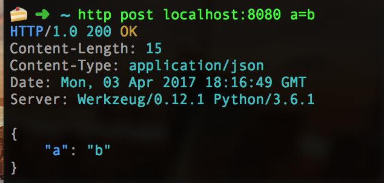

# C-Micro

A simple, flexible framework for writing microservices in C.

No, really.

### How?!

All the hard stuff is in Python/Flask. But the API provided is in C, with plenty of utility functions like `route(method, path, function)`.

### Why?!

Because I like to suffer. Also, it'd be cool to benchmark this against a pure-Flask microservice doing something intensive like fibonnacci. #webscale

## Getting Started

* Make a project directory: `mkdir <projectName> && cd <projectName>`
* Clone the repository: `git clone https://github.com/bedekelly/c-micro`
* Copy project template files: `cp c-micro/template/* .`
* Install all necessary Python libraries (sandbox built-in): `make install`
* Compile and run the server: `make run`

A simple echo-server should be running on `localhost:8080`! Test it out using `curl`, `httpie` or Postman.

